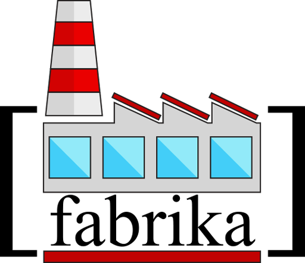

[](https://circleci.com/gh/SelimAbidin/Fabrika/tree/master)

# fabrika
fabrika is a javascript utility library for array objects that strongly support tree-shaking and performance.

## fabrika is under development.
however some functions can be used and probably will not be changed, it is your own risk to use. Just keep it in your mind.




```JS
import { uniq, uniqBy, uniqByProps } from "fabrika/uniq";

//uniq
let intArray = [1,2,1]
let result = uniq(intArray)
console.log(result) // [1,2]

// uniqBy
let objectArray = [
    {x:1, y:1},
    {x:2, y:1},
    {x:2, y:1},
]
let result = uniqBy(objectArray, "x")
console.log(result) // [{x:1, y:1}, {x:2, y:1}]

// uniqByProps
let objectArray = [
    {x:1, y:1},
    {x:2, y:1},
    {x:2, y:3},
    {x:1, y:1},
]
let result = uniqBy(objectArray, ["x", "y"])
console.log(result) // [{x:1, y:1}, {x:2, y:1}, {x:2, y:3}]
```